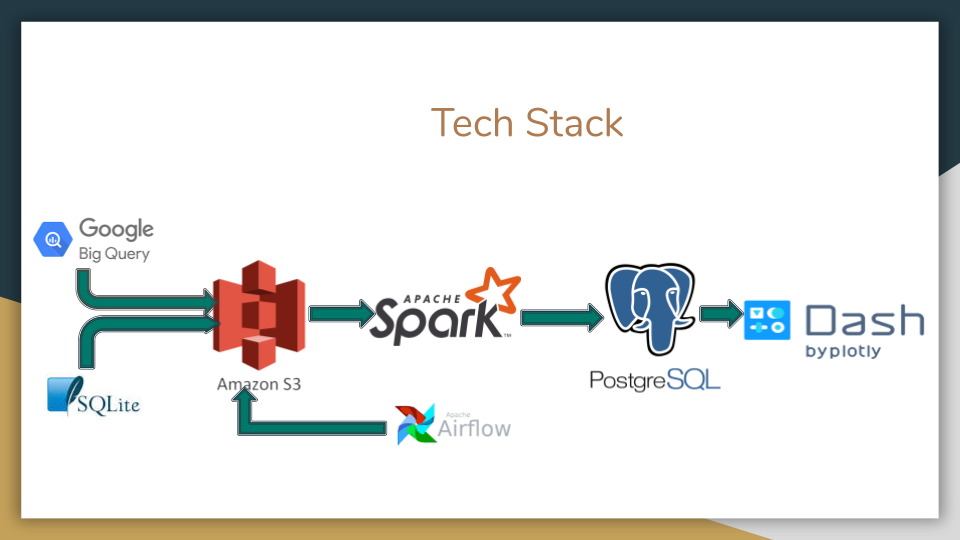

# CA-Wildfire-Risk-Management
Wildfire Risk Management Platform

### INTRODUCTION ###
Built a distributed big data pipeline on AWS by combining FIA(Forest Inventory and Analysis) and 1.88 Million US wildfires datasets. The pipeline allows users to analyze wildfire risk factors and make data driven decisions to either mitigate or prevent wildfires. 

### ARCHITECTURE ###

### DATA INGESTION ###

The FIA data set is in BigQuery. I wanted to keep the data in Amazon S3 for long term storage. First I created a bucket in GCP(Google Cloud Computing) and extracted all the data to the GCP bucket. On EC2 instance I installed google-cloud-sdk.  And used gsutil to sync GCP bucket to S3 bucket.

The 1.88 Million US Wildfires data set is in SQLite. I converted the database file to csv file and loaded to S3 bucket.

